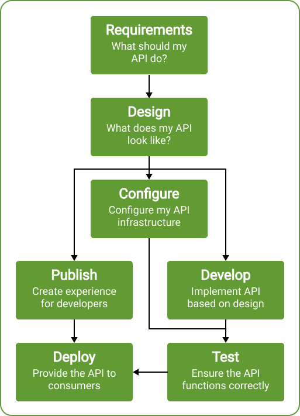
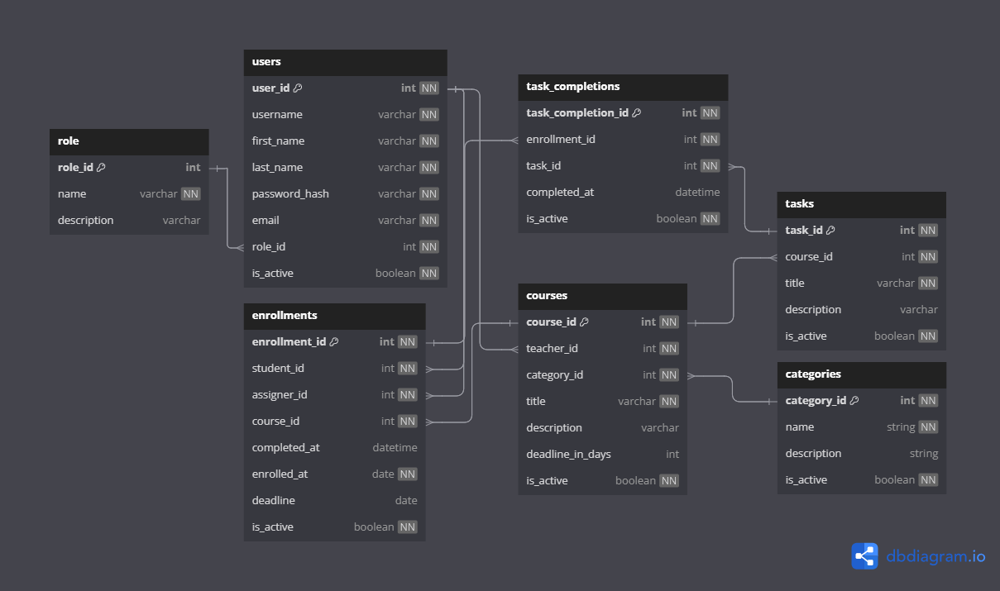

# KI-GUI

## Export requirements using poetry

`poetry export --without-hashes --format=requirements.txt > requirements.txt`

## Installing the project from github

1. `git clone <repo> -b here-we-start`
2. `cd <repo>`
3. `python -m venv .venv`
4. For Linux `source .venv/bin/activate`, for Windows `/.venv/Scripts/Activate.ps1` (or - activate.bat) - please not windows `;)`
5. `pip install -r requirements.txt`

To save time. We will not install ruff into vscode.
It will run nicely from the terminal.

[Rules](https://docs.astral.sh/ruff/rules/)

1. `ruff check --watch` - Python Linter, watches for errors in the code according to rules (see link)
2. `ruff format` - Formats the code according to the Black library

## Running the project in docker

project is running at `0.0.0.0:8000`

`docker-compose up --build`

## If docker doesn't work :)

`uvicorn api.main:app --reload` - start the project in uvicorn `--reload` when changes are reloaded

## 01

The content of the first anchor point.

- What is an API
  - Differences
- OpenAPI JSON + Swagger
- FastAPI vs Flask vs Django
- Poetry and why?
- Ruff and why?

## What is an API?

An Application Programming Interface (API) is a set of procedures, functions, protocols, and libraries used in software development.

The purpose of an API is to ensure communication between two platforms that exchange data with each other. It allows you to use already programmed solutions and integrate them into your own websites or applications.

[What is an API (Czech source)](https://www.rascasone.com/cs/blog/co-je-api)

## OpenAPI Specification (OAS) – Overview

OpenAPI Specification (OAS) is a standardized language for describing HTTP APIs, enabling consistent information sharing throughout the API lifecycle. Key points include:

### What is OpenAPI?

- A specification language for HTTP APIs, independent of programming languages  
- Typically written in YAML or JSON format  
- Ensures clear communication of API capabilities between providers and consumers  
- Provides a standardized vocabulary of terms reflecting common API concepts  

### Role in the API lifecycle

OAS serves as a central source throughout the entire API lifecycle:

- **Requirements gathering**: Helps create early API designs in a portable format  
- **Design**: Produces tangible, versionable artifacts before coding begins  
- **Development**: Supports code generation for server-side implementation  
- **Infrastructure configuration**: Automates API gateway setup and validation rules  
- **Developer experience**: Powers documentation, interactive environments, and SDK generation  
- **Testing**: Enables contract testing and security checks against the specification  



### Benefits

- Provides a “single source of truth” throughout the API lifecycle  
- Speeds development with automation and code generation  
- Improves consistency between design and implementation  
- Enhances the developer experience when working with APIs  
- Supports both “API-first” and “code-first” approaches  

OAS effectively connects the entire API lifecycle by providing a consistent way to transfer information between stages. This helps organizations ensure quality and consistency in API development.

[What is OpenAPI](https://www.openapis.org/what-is-openapi)

###

## FastAPI vs Django vs Flask

When choosing a framework for developing web applications or APIs in Python, the three most commonly considered options are **FastAPI**, **Django**, and **Flask**. Each has specific attributes that determine its suitability for different types of projects.

### Overview comparison

| **Parameter**              | **Django**                                                                                         | **FastAPI**                                                             | **Flask**                                                             |
|----------------------------|-----------------------------------------------------------------------------------------------------|--------------------------------------------------------------------------|------------------------------------------------------------------------|
| **Type**                   | Full-stack web framework                                                                            | Micro web framework                                                      | Micro web framework                                                    |
| **Usage**                  | Building complex web applications and APIs                                                          | Building APIs and microservices                                         | Building small web applications and simple APIs                        |
| **Performance**            | Fast for large-scale applications                                                                   | Very fast for APIs and microservices                                    | Slower due to synchronous processing and manual validation             |
| **Scalability**            | Scalable, but ORM and template engine can slow things down                                          | Highly scalable thanks to async code and type annotations               | Harder to scale without built-in ORM and caching                        |
| **Learning curve**         | More complex for beginners                                                                          | Easy for beginners                                                      | Medium difficulty                                                      |
| **Database tools**         | Comprehensive set (integrated ORM)                                                                  | Limited, no built-in support                                            | Limited, no built-in support                                           |
| **Asynchronous programming** | Yes, via `asyncio` but with lower efficiency                                                     | Native support (fast thanks to Pydantic)                                | No, must be handled externally                                         |
| **ORM (Object-relational mapping)** | Yes                                                                                       | No                                                                      | No                                                                     |
| **Community**              | Large and active                                                                                   | Small but rapidly growing                                               | Large and active                                                       |
| **Documentation**          | Extensive and well-maintained                                                                      | Smaller, but continuously improving                                     | Large and easily accessible                                            |
| **Advantages**             | Security, scalability, flexibility, fast prototyping, admin interface                              | Performance, speedy API development, async processing, OpenAPI/Swagger support | Flexibility, simplicity, ideal for small apps and prototypes           |
| **Disadvantages**          | Complex for beginners, more challenging debugging, less suitable for small projects                | Main files can become cluttered, lacking built-in security features     | Lacks built-in caching, ORM, and async                                 |

[GeeksforGeeks – Comparison of FastAPI with Django and Flask](https://www.geeksforgeeks.org/comparison-of-fastapi-with-django-and-flask/)

---

## FastAPI

FastAPI is a modern, fast (high-performance) web framework for building APIs in Python. It leverages standard Python type hints and offers an easy and intuitive way to create robust and high-performance interfaces.

### Key features

- **Speed**  
  Extremely high performance, comparable to NodeJS and Go (thanks to Starlette and Pydantic libraries). One of the fastest Python frameworks.

- **Fewer errors**  
  With type hints and automatic validation, developer errors are reduced by about 40%.*

- **Intuitive environment**  
  Great support in modern editors – automatic code completion and less time spent debugging.

- **Easy to use and learn**  
  Designed for straightforward and fast adoption. Minimizes the need to read extensive documentation.

- **Concise and clear code**  
  Minimizes repetitive code, providing more functionality from a single declared parameter, and fewer errors during development.

- **Robust and production-ready**  
  Automatically generated interactive documentation (Swagger UI, ReDoc) supports efficient development and testing.

- **Standardization**  
  Full compatibility with open standards for APIs – OpenAPI (formerly Swagger) and JSON Schema.


[FastAPI – Official documentation](https://fastapi.tiangolo.com/)

---

## HTTP

HTTP is a protocol for data transfer between a client and a server. It works on a request-response principle.

## HTTP request methods

The HTTP protocol defines request methods, referred to as HTTP verbs, that determine the purpose and expected result of a request. Methods can be safe, idempotent, or cacheable.

### GET

- The GET method requests a representation of the specified resource. Requests using GET should only retrieve data and should not contain a request body.

### POST

- The POST method submits an entity to the specified resource, often causing a change in state or side effects on the server.

### PUT

- The PUT method replaces all current representations of the target resource with the request payload.

### DELETE

- The DELETE method removes the specified resource.

### PATCH

- The PATCH method applies partial modifications to a resource.

## RUFF

An extremely fast Python linter and code formatter, written in Rust.

### Linter

A tool that automatically analyzes source code to find errors, bad practices, or style violations.

### Code formatter

A tool that automatically adjusts the formatting of code to make it readable and consistent.

[Ruff](https://docs.astral.sh/ruff/)

## Poetry

Poetry is a tool for `dependency management` and `packaging` in Python.

You define which libraries your project needs. Poetry installs or updates them. It keeps a list of versions (lockfile) so everything installs consistently every time, and it can prepare your project for distribution.

### Dependency management

This is the management of libraries and packages that your project needs. It ensures correct installation, consistent versions, and compatibility between packages.

For example, when installing fastapi, it will also install all the necessary packages on which it depends.

### Packaging

Packaging in Python means preparing code into a package that can be easily shared and installed.

### Creating a project

1. `poetry new poetry-demo`
2. `poetry install` – install the environment according to `pyproject.toml`
3. `poetry add fastapi` – add a new library
4. `poetry run python main.py` – run the file
5. `poetry env activate` – activate the venv

### What is pyproject.toml

The `pyproject.toml` file is the most important one. It organizes your project and its dependencies. For now, it looks like this:

```toml
[project]
name = "poetry-demo"
version = "0.1.0"
description = ""
authors = [
    {name = "Maek asdreme", email = "radagames@wot.cz"}
]
readme = "README.md"
requires-python = ">=3.9"
dependencies = [
]

[build-system]
requires = ["poetry-core>=2.0.0,<3.0.0"]
build-backend = "poetry.core.masonry.api"
```

### Dependency groups

In Poetry, `dependency groups` let you organize dependencies based on their purpose.

**Main dependencies** (usually in `tool.poetry.dependencies`) are required for running the project.

**Additional dependency groups** can be used for testing, documentation, or development.

1. `poetry add pytest --group test`
2. `poetry install --without test,docs`
3. `poetry install --with docs`
4. `poetry install --only docs`

[Poetry](https://python-poetry.org/docs/)

## 02

## Table of Contents

- Pydantic
- Annotations
- Validators
- Pydantic settings
- Loading settings from an env file
- Using dependencies

## Pydantic

Pydantic is the most widely used library for data validation in Python.

### Why use Pydantic?

- **Type hints** — with Pydantic, schema validation and serialization are driven by type annotations. Less learning, less coding, plus integration with IDEs and static analysis tools.

- **Speed** — the core validation logic of Pydantic is written in Rust. This makes Pydantic one of the fastest data validation libraries in Python.

- **JSON Schema** — Pydantic models can emit JSON schema, making it easy to integrate with other tools.

- **Strict and lax modes** — Pydantic can run in either strict mode (where data is not converted) or lax mode, where Pydantic tries to coerce the data to the correct type if needed.

- **Data classes, TypedDicts, and more** — Pydantic supports validating many standard library types, including data classes and TypedDict.

- **Customization** — Pydantic allows custom validators and serializers that can transform data in powerful ways.

- **Ecosystem** — Pydantic is used by approximately 8,000 packages on PyPI, including massively popular libraries such as FastAPI, huggingface, Django Ninja, SQLModel, and LangChain.

- **Battle-tested** — Pydantic is downloaded over 70 million times a month and is used by all FAANG companies and 20 out of the 25 largest NASDAQ-listed companies. If you’re trying to do something with Pydantic, chances are someone has done it before.

[Official Pydantic documentation](https://docs.pydantic.dev/latest/)

### Annotations

Put simply, for a type `T` there is metadata `x`: `Annotated[T, x]`. Metadata is information that provides details about other data.

### Validators

In addition to Pydantic’s built-in validation functions, you can use custom validators at the field and model levels to enforce more complex constraints and ensure data integrity.

You can use four different types of validators. All of them can be defined using the annotated pattern or the `field_validator()` decorator applied to a class method.

[Pydantic - Field Validators](https://docs.pydantic.dev/latest/concepts/validators/#field-validators)

### Settings and environment variables

In many cases, your application may require external settings or configurations, such as secret keys, database credentials, email service credentials, etc.

Most of these settings are variable (they can change), for example, database URLs. Many of them may also be sensitive, such as secret keys.

Because of this, it is common to provide these settings via environment variables that the application loads.

[FastAPI - Advanced Settings](https://fastapi.tiangolo.com/advanced/settings/)

### Pydantic Settings

Fortunately, Pydantic provides excellent functionality for handling these settings from environment variables using its built-in tools.

### Usage

If you create a model that inherits from `BaseSettings`, the model’s initializer will attempt to determine the values of any fields that were not passed as named arguments by loading them from environment variables. (Default values will still be used if the corresponding environment variable is not set.)

This makes it easy to:

- Create a clearly defined application configuration class with type annotations
- Automatically load configuration overrides from environment variables
- Manually override specific settings in the initializer if needed (e.g., for unit tests)

[Pydantic Settings](https://docs.pydantic.dev/latest/concepts/pydantic_settings/)

### Dependencies

FastAPI has a very powerful yet intuitive Dependency Injection system. It’s designed to be very straightforward so that every developer can easily integrate additional components with FastAPI.

#### Dependency Injection

“Dependency Injection” in programming is a way for your code to declare what it needs to function properly – its “Dependencies” – and then the system takes care of providing those dependencies (“injecting” them) into your code.

This is useful when you need to:

- Share logic (re-use the same piece of code).
- Share a database connection.
- Enforce security, authentication, role requirements, etc.
- And many other things…

If we wanted to explain Dependency Injection using a simple real-world analogy, we could imagine it like this (Generated by chatGPT for little kids):

Imagine you’re building a big LEGO city. Every house, car, or tree needs something special to work well – wheels, doors, or windows, for example. But if you had to look for each piece yourself every time you built something, it would be a hassle and take a lot of time.

Dependency Injection is like a magic helper. You say:
“I need wheels for the car!”
And it brings them right to you.
Or you say:
“I need doors for the house!”
And it gives them to you immediately.

You don’t have to worry about where to find them or how to make them – it takes care of everything. Thanks to that, you can build your city faster and more easily.

In the world of computer programs, it works similarly. Your program says:
“I need to connect to the database.”
And FastAPI provides it.
Or it says:
“I need to check if someone is logged in.”
And FastAPI checks that for you.

You can then focus on what you want to build, without dealing with everything else around it. It’s like having a super helper that does a lot of work for you!

[Dependencies - FastAPI](https://fastapi.tiangolo.com/tutorial/dependencies/)


## 03

### Table of Contents 03

- Organizing the project
- Creating Pydantic models
- Schemas for a given model
- Using annotations with Path parameters
- Creating routers for CRUD operations
- Splitting functionality into controllers for clarity

### Directory Structure

The directory structure serves to neatly separate the project into logical parts, making it easier to manage, read, and maintain. With clearly defined folders and files, you can, for example, effectively separate business logic, data models, tests, and configuration. This makes it simpler for multiple developers to collaborate, speeds up orientation in the code, and also simplifies deployment and further development of the project.

```bash
fastapi_project/
├── src/
│   ├── items/               # "items" module with routes, controllers, and schemas
│   │   ├── controllers.py   # Application logic for "items"
│   │   ├── routers.py       # Endpoints for "items"
│   │   └── schemas.py       # Pydantic schemas for "items"
│   ├── users/               # "users" module (example for another entity)
│   │   ├── controllers.py
│   │   ├── routers.py
│   │   └── schemas.py
│   └── __init__.py
├── config.py                # Application configuration (Pydantic Settings)
├── db.py                    # Database connection (SQLAlchemy, MongoDB)
├── models.py                # SQLAlchemy model definitions
├── main.py                  # Entry point of the application (FastAPI instance)
├── tests/                   # Tests (Pytest)
│   ├── test_items.py
│   ├── test_users.py
│   └── conftest.py
├── .env                     # Environment configuration (e.g., DATABASE_URL)
├── .gitignore               # Git ignored files
├── Dockerfile               # Docker container for the application
├── docker-compose.yml       # Docker Compose (DB, Redis, etc.)
├── pyproject.toml           # Project configuration (Poetry)
├── requirements.txt         # Dependencies (if not using Poetry)
└── README.md                # Project documentation
```

### ERD



The diagram enables efficient management of user roles, student enrollments in courses, assigned tasks, and monitoring their completion status.

1. **Table `role`**  
   - Stores information about user roles (e.g., student, teacher, administrator).  
   - Contains columns `role_id`, `name`, and `description`.

2. **Table `users`**  
   - Stores basic user data (first name, last name, email, login credentials) and references their role via `role_id`.  
   - Contains `user_id`, `username`, `password_hash`, `email`, `role_id`, `is_active`.

3. **Table `enrollments`**  
   - Records information about a student’s enrollment in a course:
     - `student_id` (who is taking the course)
     - `assigner_id` (who assigned the enrollment)
     - enrollment date info (`enrolled_at`) and completion date (`completed_at`)
     - a deadline (`deadline`)
     - a flag (`is_active`)
   - Enables tracking course progress and completion status.

4. **Table `courses`**  
   - Stores an overview of courses, their titles (`title`), descriptions (`description`), teacher ID (`teacher_id`), and category (`category_id`).  
   - Also includes a possible deadline (`deadline_in_days`) and an `is_active` flag.

5. **Table `categories`**  
   - Categorizes courses into thematic areas or subject categories.  
   - Contains `category_id`, `name`, `description`, and `is_active`.

6. **Table `tasks`**  
   - Relates to courses (`course_id`) and defines specific tasks or exercises.  
   - Contains `task_id`, `title`, `description`, `is_active`.

7. **Table `task_completions`**  
   - Links the completion of a specific task to a specific student enrollment (`enrollment_id`).  
   - Contains `task_completion_id`, `task_id`, date of completion (`completed_at`), and an `is_active` flag.

## Relationships Between Tables

- **`users` ↔ `role`** – Each user has one role (via `role_id`).
- **`enrollments` ↔ `users`** – `student_id` and `assigner_id` are foreign keys to the `users` table.
- **`enrollments` ↔ `courses`** – Information about enrolling a particular student in a particular course.
- **`tasks` ↔ `courses`** – Each task belongs to a specific course (via `course_id`).
- **`task_completions` ↔ `enrollments`** – Links the task completion to a specific “enrollment.”
- **`task_completions` ↔ `tasks`** – Specifies which task was completed.
- **`courses` ↔ `categories`** – A course belongs to a specific category (via `category_id`).
- **`courses` ↔ `users`** – A course has an assigned teacher (via `teacher_id`).

## 04

### Testing the API with the Schemathesis Library

Testing the API is a crucial step in the backend development process, as it helps uncover errors, ensures stability, and verifies correct implementation. Schemathesis is an open-source tool designed for automated API testing that leverages OpenAPI (Swagger) specifications.

- It automatically generates tests based on OpenAPI.
- It generates detailed reports and allows easy reproduction of errors using cURL.
- Proven by research – Academic studies have shown its effectiveness in detecting bugs (1.4× to 4.5× more bugs than competitors).

[Schemathesis](https://schemathesis.readthedocs.io/en/stable/)

## 05

### Middleware

Middleware is a function that works with every request before it is processed by any path operation. It also works with every response before returning it.

- It takes each request to the application
- It can do something with the request or run some code
- Then it sends the request to be processed by the rest of the application
- Subsequently, it takes the response from the application
- It can still do something with the response or run any necessary code
- Finally, it returns the response

#### Creating Middleware

To create a middleware, you use a decorator, for example `@app.middleware("https")`.

The middleware function receives:

- Request
- The `call_next` function, which takes the request as a parameter. This function adds the corresponding request to the path operation. Then it returns the response corresponding to the path operation.
- There is then an option to modify the response before returning it

### Usage

Middleware is most commonly used for:

- Logging and monitoring – information about requests and responses
- Authentication and authorization – verifying a valid token or checking permissions
- Validation and modification of requests – checking and modifying data before processing
- Modifications of outgoing responses – adjusting the structure of outgoing data, error message formats, etc.

## 06

### CORS

CORS (Cross-Origin Resource Sharing) is a security mechanism preventing browsers from sending requests between different domains without the server’s explicit permission. If the client (front-end) runs on a different domain (or port) than the server (back-end), you need to set up CORS correctly so that the browser does not block the requests.

```bash
origins = [
    "http://localhost.tiangolo.com",
    "https://localhost.tiangolo.com",
    "http://localhost",
    "http://localhost:8080",
]

app.add_middleware(
    CORSMiddleware,
    allow_origins=origins,          # Domains that can contact your back-end
    allow_credentials=True,         # Allows sending authorization data (cookies, …)
    allow_methods=["*"],            # Allowed HTTP methods (GET, POST, PUT, DELETE, …)
    allow_headers=["*"],            # Allowed headers in requests
)
```

[CORS - FastAPI](https://fastapi.tiangolo.com/tutorial/cors/)

## 07

### Deployment

Workers are parallel processes that run side by side and handle requests independently of each other.

#### Workers in FastAPI

```bash
uvicorn main:app --host 0.0.0.0 --port 8000 --workers 4
```

- This launches 4 separate processes – each with its own FastAPI instance
- Each process runs independently, typically on a different CPU
- If your code is synchronous (blocking), that’s okay – another worker will handle additional requests.

#### Async def FastAPI

- Asynchronous loop (event loop)
- Within a single process, it can handle many requests at once if they are non-blocking
- Within a single process, it can handle many requests at once if they are non-blocking

#### Comparison: sync + workers vs. async def

| Feature               | --workers + sync                      | async def                                               |
|-----------------------|---------------------------------------|---------------------------------------------------------|
| Parallelism           | At the process level                   | At the event loop level                                 |
| CPU-bound performance | Better (more processes = more cores)  | Worse (1 event loop = 1 core)                           |
| I/O-bound performance | OK, but worse scaling                  | Excellent if you use async libraries                    |
| Memory usage          | Higher (more processes, more RAM)     | Lower (1 process)                                       |
| Code complexity       | Lower (sync is simpler)               | Higher (async is harder to debug and use correctly)     |

#### Example scenario

Let’s say each request takes 2 seconds (e.g., sleeping or waiting for DB). Four requests arrive at once.

#### Comparison of API behavior with 4 concurrent requests

| Type of operation | sync + 4 workers | async + 1 worker | sync + 1 worker |
|-------------------|------------------|------------------|-----------------|
| Blocking          | ✅ ~2s           | ❌ ~8s           | ❌ ~8s          |
| Async operation   | ✅ ~2s           | ✅ ~2s           | ❌ ~8s          |

Generated by ChatGPT due to lack of documentation.

## Disclaimer

In this project, we deliberately do not use the asynchronous approach because it would require a complete transformation of the code and maintaining a consistent asynchronous architecture, which would be demanding given the benefits. Moreover, the synchronous approach is simpler to implement.

| Measurement (Run) | Async test 1 (s) | Async test 2 (s) | Async test 3 (s) | Avg. Async (s) | Worker test 1 (s) | Worker test 2 (s) | Worker test 3 (s) | Avg. Worker (s) |
|-------------------|------------------|------------------|------------------|----------------|--------------------|--------------------|--------------------|-----------------|
| First measurement | 1.4991           | 4.2614           | 10.0955          | 5.9364         | 7.6571             | 1.6365             | 2.3129             | 3.8688          |
| Second measurement| 1.7591           | 9.2658           | 12.6191          | 7.8813         | 7.4748             | 1.2358             | 8.7693             | 5.8266          |
