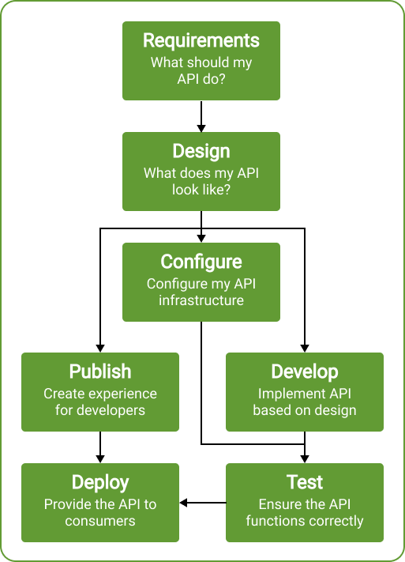
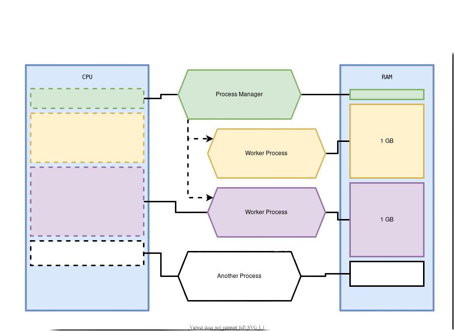
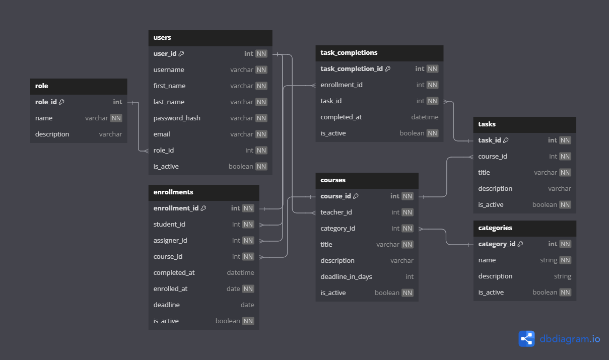

# KI-GUI

## Export requirements pomocí poetry

`poetry export --without-hashes --format=requirements.txt > requirements.txt`

## Instalace projektu z github

1. `git clone <repo>`
2. `cd <repo>`
3. `python -m venv .venv`
4. Pro Linux `source .venv/bin/activate`, Pro Windows `/.venv/Scripts/Activate.ps1`
5. `pip install -r requirements.txt`

## Spuštění projektu v dockeru

projekt běží na adrese `0.0.0.0:8000`

`docker-compose up --build`

## 01

Obsah Prvího zachytnéo bodu.

- Co je to API
  - Rozdíly
- OpenAPI json + swagger
- FastApi vs Flask vs Django
- Poetry a proč?
- Ruff a proč?

## Co je to API?

Application Programming Interface (API) je soubor procedur, funkcí, protokolů a knihoven, který se využívá při vývoji softwaru.

Smyslem API je zajištění komunikace mezi dvěma platformami, které si vzájemně vyměňují data. Umožňují využívat již naprogramovaná řešení a integrovat je do vlastních webů či aplikací.

[Co je to api](https://www.rascasone.com/cs/blog/co-je-api)

## OpenAPI Specifikace (OAS) – Přehled

OpenAPI Specification (OAS) je standardizovaný jazyk pro popis HTTP API, který umožňuje konzistentní sdílení informací v celém životním cyklu API. Klíčové body zahrnují:

### Co je OpenAPI?

- Specifikační jazyk pro HTTP API, který je nezávislý na programovacím jazyce  
- Typicky se zapisuje ve formátu YAML nebo JSON  
- Umožňuje jasnou komunikaci schopností API mezi poskytovateli a spotřebiteli  
- Poskytuje standardizovaný slovník termínů odrážející běžné koncepty API  

### Role v životním cyklu API  

OAS slouží jako centrální zdroj během celého životního cyklu API:

- **Shromažďování požadavků**: Pomáhá vytvářet rané návrhy API v přenosném formátu  
- **Návrh**: Vytváří hmatatelné, verzovatelné artefakty před začátkem kódování  
- **Vývoj**: Podporuje generování kódu pro implementaci serverové části  
- **Konfigurace infrastruktury**: Automatizuje nastavení API brány a validační pravidla  
- **Zkušenost vývojářů**: Pohání dokumentaci, interaktivní prostředí a generování SDK  
- **Testování**: Umožňuje kontraktní testování a bezpečnostní ověření oproti specifikaci  



### Výhody  

- Poskytuje „jedinou verzi pravdy“ v celém životním cyklu API  
- Zrychluje vývoj díky automatizaci a generování kódu  
- Zlepšuje konzistenci mezi návrhem a implementací  
- Zvyšuje komfort vývojářů při práci s API  
- Podporuje jak přístup „API-first“, tak „code-first“  

OAS efektivně propojuje celý životní cyklus API tím, že poskytuje konzistentní způsob přenosu informací mezi jednotlivými fázemi. To organizacím pomáhá zajistit kvalitu a konzistenci při vývoji API.

[What is OpenAPI](https://www.openapis.org/what-is-openapi)

###

## FastAPI vs Django vs Flask

Při výběru frameworku pro vývoj webových aplikací nebo API v Pythonu se nejčastěji rozhodujeme mezi třemi hlavními nástroji – **FastAPI**, **Django** a **Flask**. Každý z nich má své specifické vlastnosti, které určují jejich vhodnost pro různé typy projektů.

### Přehledové srovnání

| **Parametr**               | **Django**                                                                                     | **FastAPI**                                                              | **Flask**                                                             |
|----------------------------|-----------------------------------------------------------------------------------------------|--------------------------------------------------------------------------|----------------------------------------------------------------------|
| **Typ**                    | Full-stack web framework                                                                      | Mikro-web framework                                                     | Mikro-web framework                                                  |
| **Využití**                | Vývoj komplexních webových aplikací a API                                                     | Vývoj API a mikroservis                                                 | Vývoj malých webových aplikací a jednoduchých API                   |
| **Výkon**                  | Rychlý při budování velkých aplikací                                                         | Velmi rychlý pro API a mikroservisy                                     | Pomalejší kvůli synchronnímu zpracování a ruční validaci            |
| **Škálovatelnost**         | Škálovatelný, ale ORM a šablonovací engine mohou zpomalit                                    | Vysoce škálovatelný díky asynchronnímu kódu a typovým anotacím          | Obtížně škálovatelný bez vestavěné podpory ORM a cachování          |
| **Náročnost na učení**     | Složitější pro začátečníky                                                                    | Jednoduché pro začátečníky                                              | Střední obtížnost                                                   |
| **Nástroje pro databáze**  | Komplexní sada (integrovaný ORM)                                                             | Omezená, žádná vestavěná podpora                                        | Omezená, žádná vestavěná podpora                                    |
| **Asynchronní programování** | Ano, přes `asyncio`, ale s nižší efektivitou                                               | Nativní podpora (rychlé díky Pydantic)                                  | Ne, nutné řešit externě                                             |
| **ORM (Object-relational mapping)** | Ano                                                                                | Ne                                                                      | Ne                                                                  |
| **Komunita**               | Velká a aktivní                                                                               | Malá, ale rychle rostoucí                                               | Velká a aktivní                                                     |
| **Dokumentace**            | Rozsáhlá a dobře udržovaná                                                                   | Menší, ale neustále se zlepšující                                       | Velká a snadno dostupná                                             |
| **Výhody**                 | Bezpečnost, škálovatelnost, flexibilita, rychlé prototypování, administrace                  | Výkon, rychlost vývoje API, asynchronní zpracování, OpenAPI/Swagger podpora | Flexibilita, jednoduchost, ideální pro malé aplikace a prototypy    |
| **Nevýhody**               | Komplexní pro začátečníky, náročnější na debugování, méně vhodné pro malé projekty            | Hlavní soubory mohou být nepřehledné, chybí vestavěná bezpečnost         | Chybí vestavěná podpora cachování, ORM a asynchronizace             |

[GeeksforGeeks – Comparison of FastAPI with Django and Flask](https://www.geeksforgeeks.org/comparison-of-fastapi-with-django-and-flask/)

---

## FastAPI

FastAPI je moderní, rychlý (vysoce výkonný) webový framework pro vývoj API v Pythonu. Využívá standardní Python type hinty a poskytuje snadný a intuitivní způsob, jak vytvářet robustní a výkonná rozhraní.

### Klíčové vlastnosti

- **Rychlost**  
  Velmi vysoký výkon, srovnatelný s NodeJS a Go (díky knihovnám Starlette a Pydantic). Patří mezi nejrychlejší Python frameworky.

- **Méně chyb**  
  Díky type hintům a automatické validaci snižuje množství chyb způsobených vývojáři přibližně o 40%. *

- **Intuitivní prostředí**  
  Skvělá podpora v moderních editorech – automatické doplňování kódu a méně času stráveného laděním.

- **Snadné použití a učení**  
  Navrženo pro jednoduché a rychlé osvojení. Minimalizuje potřebu čtení rozsáhlé dokumentace.

- **Stručný a přehledný kód**  
  Minimalizace duplicitního kódu, více funkcionalit z jednoho deklarovaného parametru a méně chyb při vývoji.

- **Robustní a připravený na produkci**  
  Automaticky generovaná interaktivní dokumentace (Swagger UI, ReDoc) podporuje efektivní vývoj i testování.

- **Standardizace**  
  Plná kompatibilita s otevřenými standardy pro API – OpenAPI (dříve Swagger) a JSON Schema.



[FastAPI – Oficiální dokumentace](https://fastapi.tiangolo.com/)

---

## HTTP

HTTP je protokol pro přenos dat mezi klientem a serverem. Funguje na principu požadavků a odpovědí.

## HTTP request methods

HTTP protokol definuje metody požadavků, označované jako HTTP slovesa, které určují účel a očekávaný výsledek požadavku. Metody mohou být bezpečné, idempotentní nebo kešovatelné.

### GET

- Metoda GET požaduje reprezentaci zadaného prostředku. Požadavky používající metodu GET by měly načítat pouze data a neměly by obsahovat obsah požadavku.

### POST

- Metoda POST odešle entitu zadanému prostředku, což často způsobí změnu stavu nebo vedlejší efekty na serveru.

### PUT

- Metoda PUT nahradí všechny aktuální reprezentace cílového prostředku obsahem požadavku.

### DELETE

- Metoda DELETE odstraní zadaný prostředek.

### PATCH

- Metoda PATCH aplikuje na prostředek částečné změny.

## RUFF

Extrémně rychlý Python linter a formátovač kódu, napsaný v Rustu.

### Linter

Je nástroj, který automaticky analyzuje zdrojový kód a hledá chyby, špatné praktiky nebo porušení stylových pravidel.

### Code formatter

Je nástroj, který automaticky upravuje formátování kódu, aby byl čitelný a konzistentní.

[Ruff](https://docs.astral.sh/ruff/)

## Poetry

Poetry je nástroj pro `dependency management` and `packaging` v jazyce Python.

Nadefinuje se jaké knihovny projekt potřebuje. Poetry si je nainstaluje nebo aktualizuje. Udržuje si seznam verzí (lockfile), aby se vše instalovalo stejně pokaždé, a umí tvůj projekt připravit k distribuci.

### Depedency management

Je správa knihoven a balíčků, které tvůj projekt potřebuje. Zajišťuje správnou instalaci, konzistentní verze a kompatibilitu mezi balíčky.

Např. když se instaluje fastapi, tak se nainstalují všechny potřebné balíčky, na kterých závísí.

### Packaging

Packaging (balíčkování) v Pythonu znamená přípravu kódu do podoby package, který lze snadno sdílet a instalovat.

### Vytvoření projektu

1. `poetry new poetry-demo`
2. `poetry install` - instalace prostředí podle `pyproject.toml`
3. `poetry add fastapi` - přidání nové knihovny
4. `poetry run python main.py` - spuštění souboru
5. `poetry env activate` - aktivace venv

### Co je to pyproject.toml

Soubor `pyproject.tom`l je zde nejdůležitější. To bude organizovat váš projekt a jeho závislosti. Zatím to vypadá takto:

```toml
[project]
name = "poetry-demo"
version = "0.1.0"
description = ""
authors = [
    {name = "Maek asdreme", email = "radagames@wot.cz"}
]
readme = "README.md"
requires-python = ">=3.9"
dependencies = [
]

[build-system]
requires = ["poetry-core>=2.0.0,<3.0.0"]
build-backend = "poetry.core.masonry.api"
```

### Depedency groups

V Poetry umožňují `dependency groups` organizovat závislosti podle jejich účelu.

**Hlavní závislosti** (běžně v`tool.poetry.dependencies`) jsou nutné pro běh projektu.

**Další skupiny závislostí** slouží například pro testování, dokumentaci nebo vývoj.

1. `poetry add pytest --group test`
2. `poetry install --without test,docs`
3. `poetry install --with docs`
4. `poetry install --only docs`

[Poetry](https://python-poetry.org/docs/)

## 02

## Pydantic

Pydantic je nejpoužívanější knihovna pro validaci dat v jazyce Python.

### Proč používat Pydantic?

- **Typové nápovědy** — s Pydanticem je validace schématu a serializace řízena typovými anotacemi. Méně učení, méně psaní kódu a integrace s IDE a nástroji statické analýzy.

- **Rychlost** — jádro validační logiky Pydanticu je napsáno v jazyce Rust. Díky tomu patří Pydantic mezi nejrychlejší knihovny pro validaci dat v jazyce Python.

- **Schéma JSON** — modely Pydantic mohou emitovat schéma JSON, což umožňuje snadnou integraci s dalšími nástroji.

- **Striktní a laxní režim** — Pydantic může běžet buď ve striktním režimu (kdy se data nekonvertují), nebo v laxním režimu, kdy se Pydantic v případě potřeby snaží data přimět ke správnému typu.

- **Datové třídy, TypedDicts a další** — Pydantic podporuje validaci mnoha standardních typů knihoven včetně datových tříd a TypedDict.

- **Přizpůsobení** — Pydantic umožňuje vlastní validátory a serializátory, které mění způsob zpracování dat mnoha výkonnými způsoby.

- **Ekosystém** — Pydantic používá přibližně 8 000 balíčků na PyPI, včetně masově populárních knihoven jako FastAPI, huggingface, Django Ninja, SQLModel a LangChain.

- **Battle-tested** — Pydantic je stahován více než 70 milionkrát měsíčně a používají ho všechny společnosti FAANG a 20 z 25 největších společností na burze NASDAQ. Pokud se snažíte s Pydanticem něco udělat, pravděpodobně už to udělal někdo jiný.

[Oficiální dokumentace Pydantic](https://docs.pydantic.dev/latest/)

### Anotace

Zjednodušeně lze říci, že pro typ `T` existují metadata `x`: `Annotated[T,x]`. Metadata jsou data, která poskytují informaci o jiných datech

### Validátory

Kromě vestavěných validačních funkcí Pydanticu můžete využít vlastní validátory na úrovni polí a modelů, abyste vynutili složitější omezení a zajistili integritu dat.

Lze použít čtyři různé typy validátorů. Všechny lze definovat pomocí anotovaného vzoru nebo pomocí dekorátoru `field_validator()`, který se aplikuje na metodu třídy

[Pydantic - Field Validators](https://docs.pydantic.dev/latest/concepts/validators/#field-validators)

### Nastavení a enviroment variables

Ve mnoha případech může vaše aplikace potřebovat externí nastavení nebo konfigurace, například tajné klíče, přihlašovací údaje k databázi, přístupové údaje k e-mailovým službám atd.

Většina těchto nastavení je proměnná (může se měnit), například adresy URL databází. Mnohá z nich mohou být také citlivá, například tajné klíče.

Z tohoto důvodu je běžné poskytovat tato nastavení prostřednictvím proměnných prostředí, které jsou načítány aplikací.

[FastAPI - Advanced Settings](https://fastapi.tiangolo.com/advanced/settings/)

### Pydantic Settings

Naštěstí Pydantic poskytuje skvělou užití pro zpracování těchto nastavení pocházejících z proměnných prostředí pomocí nástroje Pydantic.

### Použití

Pokud vytvoříte model, který dědí od `BaseSettings`, inicializátor modelu se pokusí určit hodnoty všech polí, která nebyla předána jako pojmenované argumenty, načtením z proměnných prostředí. (Výchozí hodnoty se stále použijí, pokud odpovídající proměnná prostředí není nastavena.)

To usnadňuje:

- Vytvoření jasně definované konfigurační třídy aplikace s typovými anotacemi
- Automatické načítání úprav konfigurace z proměnných prostředí
- Ruční přepsání konkrétních nastavení v inicializátoru, pokud je to potřeba (např. při jednotkových testech)

[Pydantic Settings](https://docs.pydantic.dev/latest/concepts/pydantic_settings/)

### Dependencies

FastAPI má velmi výkonný, ale intuitivní systém Dependency Injection. Je navržen tak, aby jeho použití bylo velmi jednoduché a aby každý vývojář mohl snadno integrovat další komponenty s FastAPI.

#### Dependency Injection

„Dependency Injection“ znamená v programování způsob, jakým může váš kód deklarovat věci, které potřebuje k tomu, aby správně fungoval a mohl je používat – tedy své „Dependencies“ (závislosti). A poté se tento systém postará o vše potřebné, aby vašemu kódu tyto požadované závislosti poskytl („injektoval“ tyto závislosti).

Toto je užitečné když potřebujeme:

- Mít sdílenou logiku (opakovaně používat stejnou část kódu).
- Sdílet připojení k databázi.
- Prosazovat bezpečnost, autentizaci, požadavky na role atd.
- A mnoho dalších věcí…

Pokud bychom chtěli princip Dependency Injection vysvětlit na jednoduchém příkladu ze skutečného světa, můžeme si to představit takto (Vygenerováno chatGPT pro dětičky):

Představte si, že stavíte velké LEGO město. Každý dům, autíčko nebo strom potřebuje něco speciálního, aby dobře fungoval – třeba kolečka, dveře nebo okna. Ale kdybyste museli každý kousek hledat sami pokaždé, kdy něco stavíte, byla by to otrava a zabralo by to spoustu času.

Dependency Injection je něco jako kouzelný pomocník. Vy mu řeknete:
„Potřebuju kolečka na autíčko!“
A on vám je rovnou přinese.
Nebo řeknete:
„Potřebuju dveře na dům!“
A on vám je okamžitě dá.

Nemusíte se starat o to, kde je hledat nebo jak je vyrobit – on to všechno zařídí. Díky tomu můžete rychleji a snadněji stavět svoje město.

Ve světě počítačových programů to funguje podobně. Váš program řekne:
„Potřebuju se připojit k databázi.“
A FastAPI mu to zařídí.
Nebo řekne:
„Potřebuju zkontrolovat, jestli se někdo přihlásil.“
A FastAPI to prověří za vás.

Vy se pak můžete soustředit jen na to, co chcete postavit, a nemusíte řešit všechno okolo. Je to jako když máte super pomocníka, co za vás udělá spoustu práce!

[Dependencies - FastApi](https://fastapi.tiangolo.com/tutorial/dependencies/)

## 03

### Obsah

- Vytváření organizace projektu
- Vytváření Pydantic modelů
- Schémata pro daný model
- Využití anotací s Path parametry
- Vytváření routerů pro CRUD operace
- Rozdělení funkcionality do controllerů pro přehlednost

### Adresářová struktura

Adresářová struktura slouží k přehlednému rozdělení projektu na logické části, což zjednodušuje jeho správu, čitelnost a udržitelnost. Díky jasně definovaným složkám a souborům lze například efektivně oddělit obchodní logiku, datové modely, testy a konfiguraci. Tím se usnadňuje spolupráce více vývojářů, rychlejší orientace v kódu a v neposlední řadě také zjednodušuje nasazení a další rozvoj projektu.

```bash
fastapi_project/
├── src/
│   ├── items/               # Modul "items" s routami, kontrolery a schématy
│   │   ├── controllers.py   # Aplikační logika pro "items"
│   │   ├── routers.py       # Endpointy pro "items"
│   │   └── schemas.py       # Pydantic schémata pro "items"
│   ├── users/               # Modul "users" (příklad pro další entitu)
│   │   ├── controllers.py
│   │   ├── routers.py
│   │   └── schemas.py
│   └── __init__.py
├── config.py                # Konfigurace aplikace (Pydantic Settings)
├── db.py                    # Připojení k databázi (SQLAlchemy, MongoDB)
├── models.py                # Definice SQLAlchemy modelů
├── main.py                  # Vstupní bod aplikace (FastAPI instance)
├── tests/                   # Testy (Pytest)
│   ├── test_items.py
│   ├── test_users.py
│   └── conftest.py
├── .env                     # Konfigurace prostředí (např. DATABASE_URL)
├── .gitignore               # Ignorované soubory Git
├── Dockerfile               # Docker kontejner pro aplikaci
├── docker-compose.yml       # Docker Compose (DB, Redis apod.)
├── pyproject.toml           # Konfigurace projektu (Poetry)
├── requirements.txt         # Závislosti (pokud se nepoužívá Poetry)
└── README.md                # Dokumentace projektu
```

### ERD



Diagram umožňuje efektivně spravovat uživatelské role, zápisy studentů do kurzů, přiřazené úkoly a monitorovat jejich stav dokončení.

1. **Tabulka `role`**  
   - Uchovává informace o rolích uživatelů (např. student, učitel, administrátor).  
   - Obsahuje sloupce `role_id`, `name` a `description`.

2. **Tabulka `users`**  
   - Uchovává základní údaje o uživatelích (jméno, příjmení, e-mail, přihlašovací údaje) a odkaz na jejich roli přes `role_id`.  
   - Obsahuje  `user_id`, `username`, `password_hash`, `email`, `role_id`, `is_active`.

3. **Tabulka `enrollments`**  
   - Zaznamenává informace o zápisu studenta do kurzu:
     - `student_id` (kdo se účastní kurzu)
     - `assigner_id` (kdo zápis přiřadil)
     - údaje o datech zápisu (`enrolled_at`) a dokončení (`completed_at`)
     - deadline (`deadline`)
     - příznak (`is_active`)
   - Umožňuje sledování průběhu studia a stav dokončení kurzu.

4. **Tabulka `courses`**  
   - Uchovává přehled kurzů, jejich tituly (`title`), popisy (`description`), id učitele(`teacher_id`) a na kategorii (`category_id`).  
   - Obsahuje i možnost deadlinu (`deadline_in_days`) a příznak `is_active`.

5. **Tabulka `categories`**  
   - Rozřazuje kurzy do tématických okruhů nebo předmětových kategorií.  
   - Obsahuje `category_id`, `name`, `description`, `is_active`.

6. **Tabulka `tasks`**  
   - Vztahuje se ke kurzům (`course_id`) a definuje konkrétní úkoly či cvičení.  
   - Obsahuje `task_id`, `title`, `description`, `is_active`.

7. **Tabulka `task_completions`**  
   - Spojuje dokončení konkrétního úkolu s konkrétním zápisem studenta (`enrollment_id`).  
   - Obsahuje `task_completion_id`, `task_id`, datum splnění (`completed_at`) a příznak `is_active`.

## Vztahy mezi tabulkami

- **`users` ↔ `role`** – Každý uživatel má jednu roli (přes `role_id`).
- **`enrollments` ↔ `users`** – `student_id` a `assigner_id` jsou cizí klíče do tabulky `users`.
- **`enrollments` ↔ `courses`** – Informace o zapsání konkrétního studenta do konkrétního kurzu.
- **`tasks` ↔ `courses`** – Každý úkol patří do konkrétního kurzu (přes `course_id`).
- **`task_completions` ↔ `enrollments`** – Spojuje splnění úkolu s konkrétní „enrollment“.
- **`task_completions` ↔ `tasks`** – Určuje, který úkol byl splněn.
- **`courses` ↔ `categories`** – Kurz spadá do konkrétní kategorie (přes `category_id`).
- **`courses` ↔ `users`** – Kurz má přiřazeného učitele (přes `teacher_id`).
